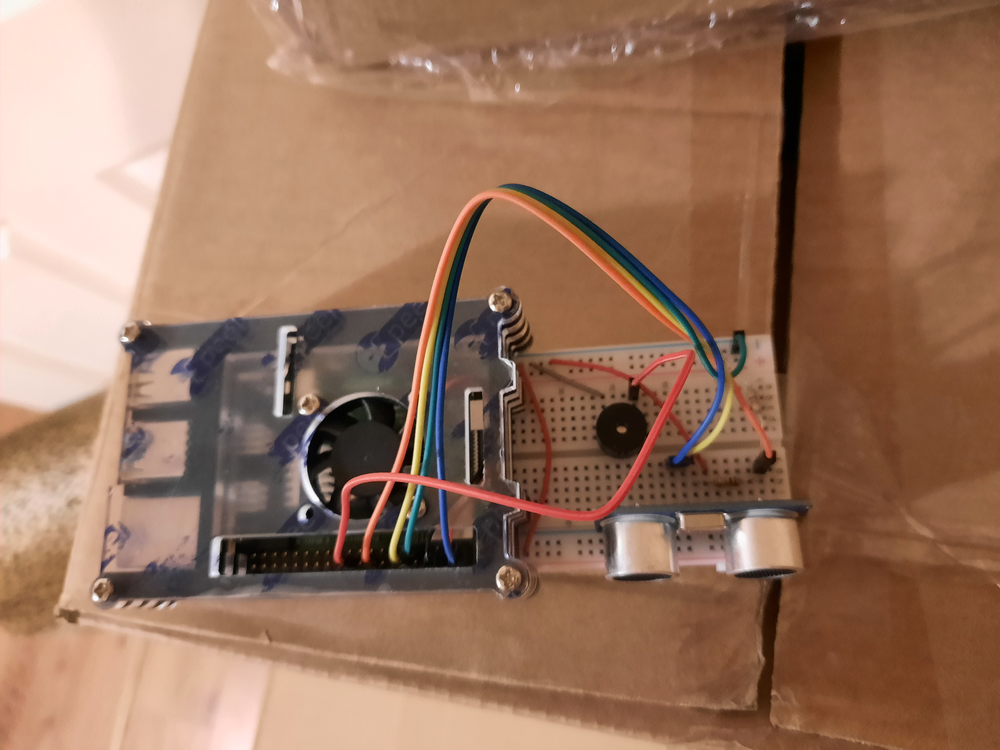

# pi-security-system

This security system was made using a Pi, my Samsung A51, and using my laptop as the client. The system uses an ultrasonic sensor connected to the pi to determine when there is an intruder, which then sends a request to the phone server for a camera image, then saves the image of the intruder (and also buzzes the attached buzzer). The pi also runs a server which the client can connect to, which shows a list of times an intruder was detected, and the image that was captured using the phone.

## Setup

Setup the pi, ultrasonic sensor, and buzzer as shown (use the pins numbers in pi/main.py as a guide):



Then, install the project on both the Pi and phone (any phone that can run [Termux](https://termux.com/))

On the phone:

```bash
cd phone
node index.js
```

On the pi:

```bash
cd pi
python3 main.py & python3 server.py
```

Then, simply type ```http://<pi_ip_adress>:8081``` into the clients browser and you are good to go!
